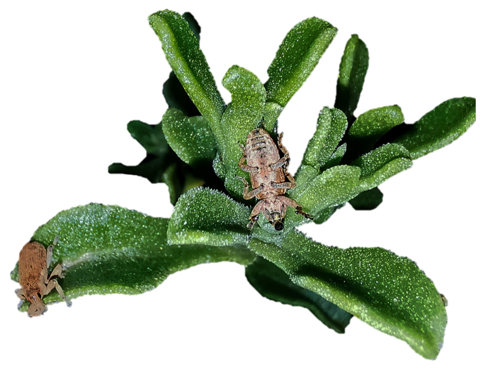

# RADseq *Cryophytum crystallinum*

## 🧬 **Linux and R scripts for a RADseq analysis pipeline**

Contact Clarke van Steenderen at vsteenderen@gmail.com or clarke.vansteenderen@ru.ac.za for queries
<br><br> 



*Image credit: David Taylor*

## Setup

The folder structure of each individual project should resemble this, adapted to the number of plates present:

```plaintext
your_repository/
└── job_files/
      	├── 0_index_refgenome.job	
      	├── 1_subsample.job
      	├── 2_fastqc.job		
      	├── 3_demultiplex.job
      	├── 4_align_and_stacks_denovo.job	
      	├── 4_align_and_stacks_refgenome.job		
└── your_RADseq_data_folder/  
    ├── plate_1/  
    │   ├── filenameA_R1_001.fastq.gz  
    │   └── filenameA_R2_001.fastq.gz  
    └── plate_2/  
    │   ├── filenameB_R1_002.fastq.gz  
    │   └── filenameB_R2_002.fastq.gz  
    └── barcodes/  
    │   ├── internal_indexes_plate_1.txt  
    │   ├── internal_indexes_plate_2.txt  
    │   └── pops_all.txt
    └──ref_genome/	
	├── ncbi_dataset/ (other applicable folders here, if a reference genome is available)
```

On an HPC, create the necessary folders (example below for 2 plates):

```
mkdir -p RADseq_project/data/plate_1 RADseq_project/data/plate_2 RADseq_project/data/barcodes RADseq_project/data/refgenome RADseq_project/jobfiles
```

* Move the job files from this repo into the **jobfiles/** folder
* Move your data from the sequencing company (Read 1 and Read 2 files) into each corresponding plate folder
* If a reference genome is available, download it from NCBI and move it to the **ref_genome/** folder
* Create a sample sheet for the samples on each plate, with the columns below (well, origin, and sample_id are essential).

For example, **samples_plate_1.csv**:

| well | origin       | sample_id | lat      | lon      |
|------|--------------|-----------|----------|----------|
| C2   | Dwarskersbos | DWSA1     | -32.7032 |  18.2203 |
| D3   | Dwarskersbos | DWSA3     | -32.7032 |  18.2203 |
| G6   | Dwarskersbos | DWSA4     | -32.7032 |  18.2203 |
| E9   | Paternoster  | PNSA1     | -32.8096 | 17.89104 |

**samples_plate_2.csv**:

| well | origin       | sample_id | lat      | lon      |
|------|--------------|-----------|----------|----------|
| C1   | Dwarskersbos | DWSA2     | -32.7032 | 18.2203  |
| F3   | Cyprus       | CYP1      | 35.1264  | 33.4299  |
| H3   | Cyprus       | CYP4      | 35.1264  | 33.4299  |
| A4   | Mexico       | MX01.2    | 27.49364 | -114.149 |
| D4   | Mexico       | MX01.3    | 27.45517 | -114.136 |

* If there is more than one plate, create another single file with all sample info combined -> e.g. **all_plates.csv**

| well | origin       | sample_id | lat      | lon      |
|------|--------------|-----------|----------|----------|
| C2   | Dwarskersbos | DWSA1     | -32.7032 |  18.2203 |
| D3   | Dwarskersbos | DWSA3     | -32.7032 |  18.2203 |
| G6   | Dwarskersbos | DWSA4     | -32.7032 |  18.2203 |
| E9   | Paternoster  | PNSA1     | -32.8096 | 17.89104 |
| C1   | Dwarskersbos | DWSA2     | -32.7032 | 18.2203  |
| F3   | Cyprus       | CYP1      | 35.1264  | 33.4299  |
| H3   | Cyprus       | CYP4      | 35.1264  | 33.4299  |
| A4   | Mexico       | MX01.2    | 27.49364 | -114.149 |
| D4   | Mexico       | MX01.3    | 27.45517 | -114.136 |

* Create an internal index file for each plate, and a single population info file for all samples. Use the functions in the R script in the **generate_barcodes/** folder:

```{r}
# source the functions
source("generate_barcodes/barcode_functions.R")

# read in sample info for plate 1
plate_1 = read.csv("samples_plate_1.csv")
head(plate_1)

plate_2 = read.csv("ssamples_plate_2.csv")
head(plate_2)

# run function
plate_1_indexes = create_internal_indexes(plate_samples = plate_1)
plate_2_indexes = create_internal_indexes(plate_samples = plate_2)

# write out as text files
write.table(plate_1_indexes,
           file = "internal_indexes_plate_1.txt", sep = "\t",             
           row.names = FALSE, col.names = FALSE, quote = FALSE, eol = "\n")

write.table(plate_2_indexes,
            file = "internal_indexes_plate_2.txt", sep = "\t",             
            row.names = FALSE, col.names = FALSE, quote = FALSE, eol = "\n")

```

Now create a full population info file for samples across all plates:

```{r}
sample_sheet = read.csv("all_plates.csv")
pops = create_pop_file(sample_sheet = sample_sheet)

# save as a txt file
write.table(pops, file = "sample_info/pops_all.txt", sep = "\t",             
            row.names = FALSE, col.names = FALSE, quote = FALSE, eol = "\n")
```

* Move the internal_indexes_plate_n.txt and pops_all.txt files into the **barcodes/** folder

## RUN LINUX JOB SCRIPTS

### 🔵 index_refgenome.job

If you have a reference genome, run this script to index it (indexing makes it easier to work with further downstream). Example job submission (change the REFERENCE_INDEX path accordingly to set the directory containing the reference genome):

```
qsub -v REFERENCE_INDEX="/mnt/lustre/users/cvansteenderen/RADseq_crystallinum/data/ref_genome/ncbi_dataset/data/GCA_030267885.1" 0_index_refgenome.job
```

### 🔵 fastqc.job

This runs a quality check on the data received from the sequencer:

BASE_DIR = the directory housing your data, separated into plate files. In the directory template example here -> **your_RADseq_data_folder/**
NUM_PLATES = the number of plates you have

```
qsub -v BASE_DIR="/mnt/lustre/users/cvansteenderen/RADseq_crystallinum/data/Dean/IcePlant.RawData",NUM_PLATES=2 fastqc.job
```

### 🔵 1_demultiplex.job

This step takes in the internal index information for each sample on each plate (the files you created that are now in **barcodes/**), and searches through the sequence data to find all the fragments that belong to each unique sample. It creates an output folder called **stacksoutput/**, and a folder for each plate. E.g. **stacksoutput/plate_1** and **stacksoutput/plate_2**. Each plate folder will contain a folder (.fq.gz) per sample. Once it has completed demultiplexing, the script creates a new folder called **combined_plates/**, into which it puts all samples from all plates. It then checks for sample folders that are abnormally small, and moves those into a new folder called **removed_zipped/**. The remaining good samples are put into a folder called **ready/**. The barcodes folder is updated to include these ready samples, as the removed ones should no longer be in the sample list. This sample list is saved as **barcodes/bothplates_pops.txt**.		
The file structure should resemble: **your_RADseq_data_folder/stacksoutput/combined_plates/ready** and **your_RADseq_data_folder/barcodes/bothplates_pops.txt**

### 🔵 subsample.job

If your demultiplexed sample files are very large (500MB - 1GB), consider subsampling them (selecting only a fraction of the fragments) before continuing with Stacks. To subsample, run this job script:

INPUT_DIR = the path to your ready samples that have been demultiplexed
SAMPLERATE = the proportion of fragments to keep

This uses the reformat.sh function in the bbmap library, where N fragments are randomly selected, while keeping the correct Read1 and Read2 pairs.

```
qsub INPUT_DIR="/mnt/lustre/users/cvansteenderen/RADseq_crystallinum/data/Admera/stacksoutput/combined_plates/ready",SAMPLERATE=0.1 1_subsample.job
```
